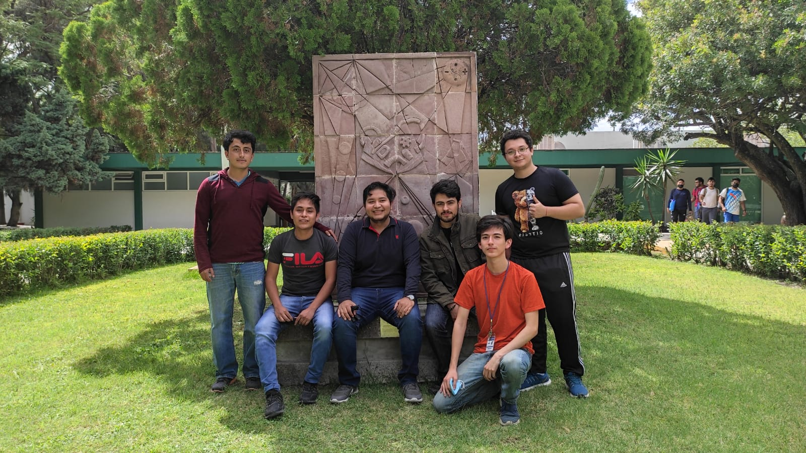
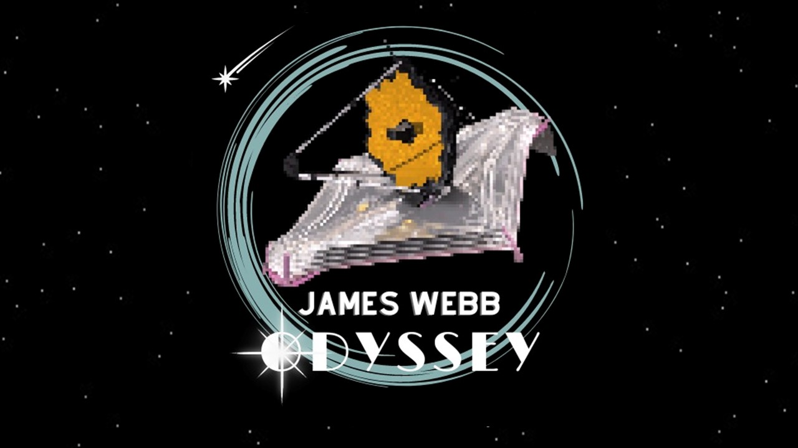
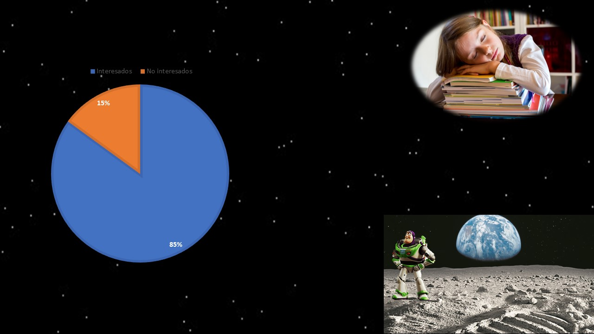
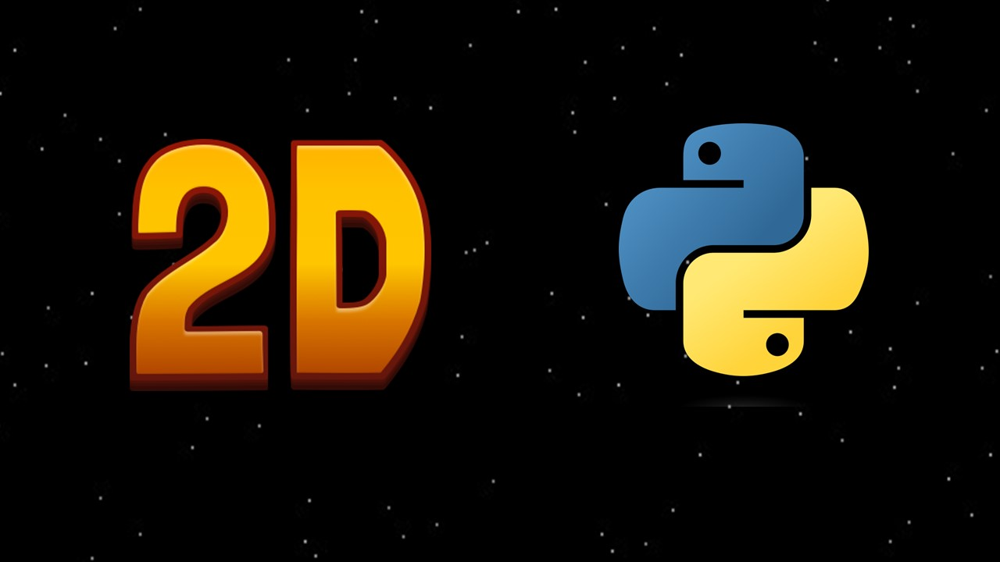
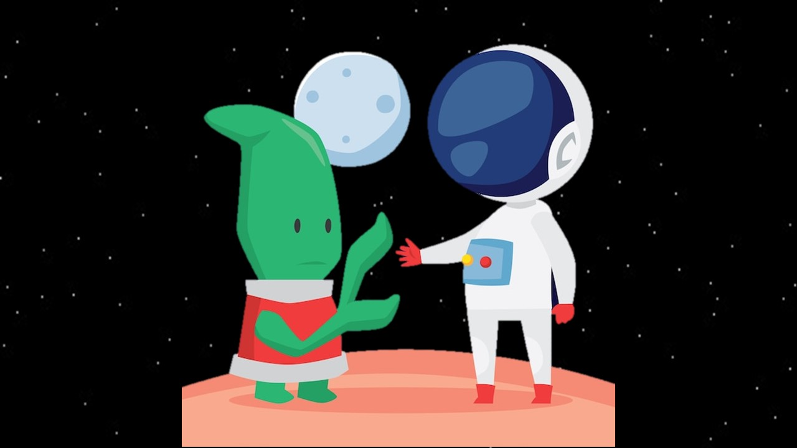
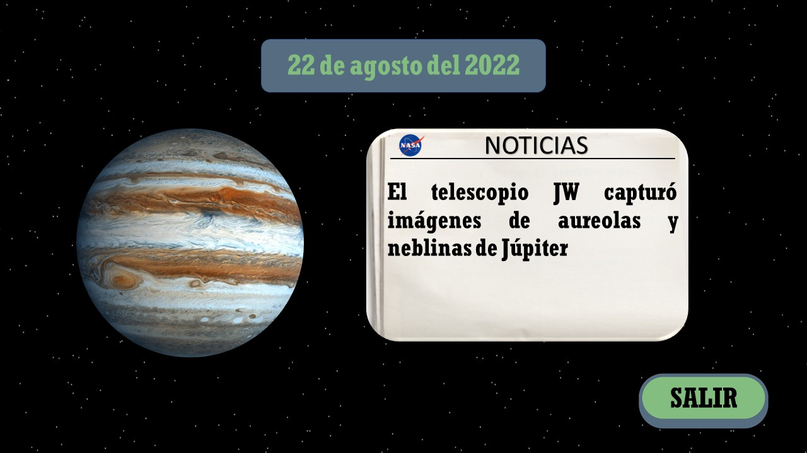
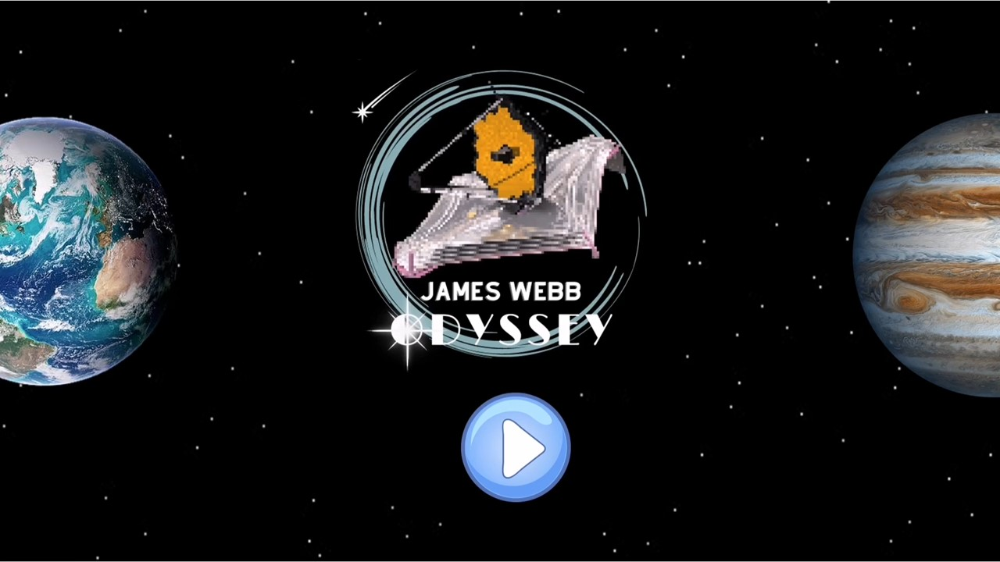
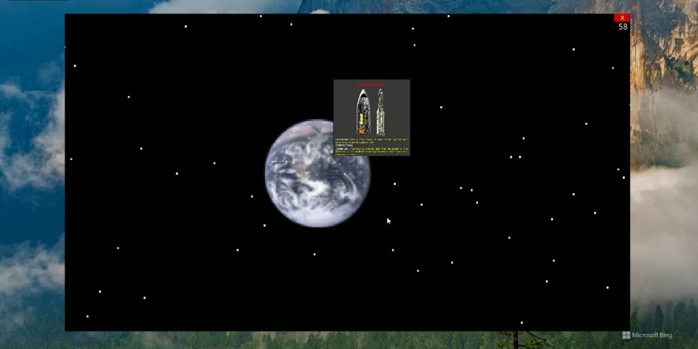

# TEAM ROCKET
## **Challenge:** [LEARNING THROUGH THE LOOKING GLASS](https://2022.spaceappschallenge.org/challenges/2022-challenges/through-the-looking-glass/details)

## Team for the Nasa Space Apps Challege 2022
- Juan Rivera Vargas
- Christopher Malagon Escutia
- Luis Angel Anguiano Muñiz
- Francisco Iván Acevedo Colunga
- Erick Eduardo Acevedo Colunga
- Luis Ricardo Lara Romo

## Project Development

- **"According to a Harris Poll and LEGO survey conducted in the United States, United Kingdom and China, 86% of children between 8 and 12 years of age say they are interested in space exploration and 90% of them want to learn more."**
- **"But how many of those children are able to read a scientific article?"**
- **"If we know that only 56% of young people read for pleasure and the language used in scientific articles is difficult to understand for a child or adolescent"**
- **"In addition, 2% of children believe that the first person to walk on the moon was Buzz Lightyear."**

Our challenge is to make a fun video game to show the capabilities of the J.W Telescope, our idea of solution we began to develop as a 2D game concept since it is easier to perform compared to a 3D development and we use the Python programming language, specifically the **Ursina** library 

The objective of our project is to encourage young people to learn about space exploration in a dynamic and fun way because learning is not fought with fun.

Our way of including news or data about discoveries that have been made with the James Webb Space Telescope is by using pop-ups in the game like the one shown below.

The final game concept we propose is **JAMES WEBB ODYSSEY:** a video game aimed at children and teenagers to learn about the incredible capabilities of the J.W Telescope while having fun *exploring outer space, dodging comets and discovering new celestial bodies.*
You can see the proposal of the video game functioning in the following link: [DEMONSTRATION](https://drive.google.com/file/d/1dl9AsqIF_nlSN5OrzdpbXx-cbWNE1Wzt/view?usp=sharing)

## Prototype
Using Python and the Ursina library we managed to develop a functional prototype of the project itself that you can find in the following link: [Functional Prototype](https://drive.google.com/file/d/18GZtK8YS1SVLKd62_-2onxvnR4_KKJ3K/view?usp=sharing)

The Python code and all the necessary resources for its operation can be found in the following link: [Files](https://github.com/luxur10/ROCKET/tree/main/JUEGO)

## Referencias
- [Lego Survey](https://decoracion.trendencias.com/dormitorio/85-ninos-esta-interesado-espacio-estudio-lego)
- NASA, [First Image of a Black Hole](https://solarsystem.nasa.gov/resources/2319/first-image-of-a-black-hole/)
- NASA, [Hubble Space Telescope](https://www.nasa.gov/mission_pages/hubble/main/index.html)
- NASA, [James Webb Space Telescope](https://www.nasa.gov/mission_pages/webb/main/index.html)
- [Pixel It](https://giventofly.github.io/pixelit/)
- [Ursina](https://github.com/pokepetter/ursina.git)
- National Geographic, [Launch of the James Webb telescope](https://www.nationalgeographicla.com/ciencia/2021/12/se-lanzo-el-telescopio-espacial-james-webb-el-mas-potente-de-la-historia)
