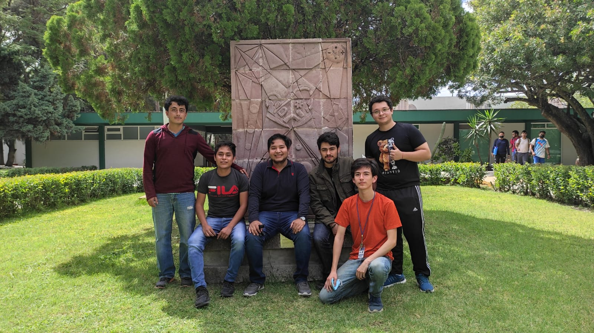
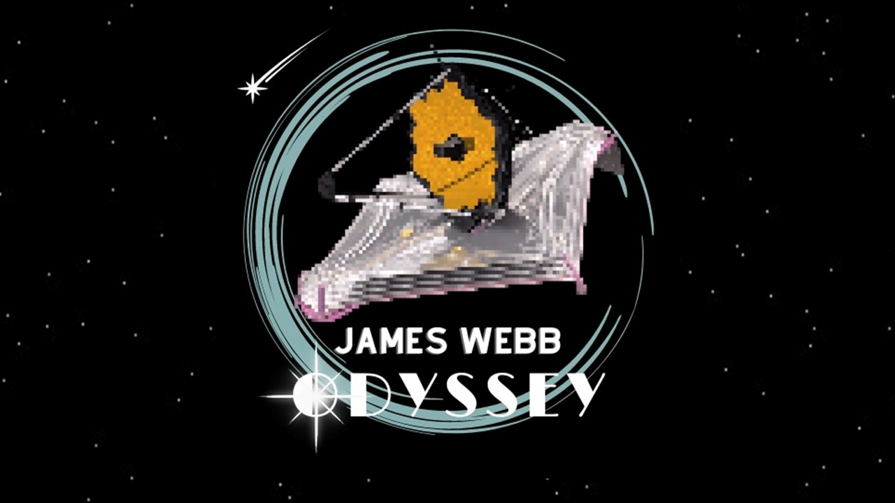
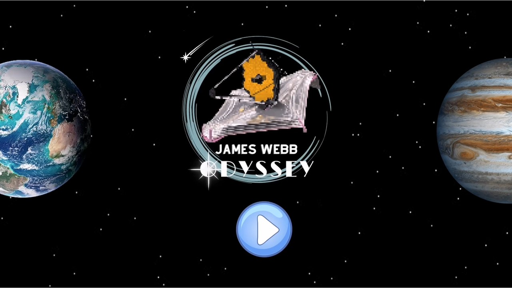

# EQUIPO ROCKET
## **Challenge:** [LEARNING THROUGH THE LOOKING GLASS](https://2022.spaceappschallenge.org/challenges/2022-challenges/through-the-looking-glass/details)

## Equipo para el hackathon de Nasa Space Apps Challege 
- Juan Rivera Vargas
- Christopher Malagon Escutia
- Luis Angel Anguiano Muñiz
- Francisco Iván Acevedo Colunga
- Erick Eduardo Acevedo Colunga
- Luis Ricardo Lara Romo

## Desarrollo del Proyecto

- **"Según una encuesta de Harris Poll y LEGO realizada en Estados Unidos, Reino Unido y China, el 86% de los niños de entre 8 y 12 años de edad dicen estar interesados en la exploración espacial y el 90% de ellos quiere aprender más."**
- **"Perooo ¿Cuantos de esos niños son capaces de leer un articulo cientifico?"**
- **"Si sabemos que unicamente el 56% de los jovenes leen por gusto y el lenguaje utilizado en los articulos cientificos es de dificil comprención para un niño o adolescente"**
- **"Además  un 2% de los niños cree que la primera persona en caminar sobre la luna fue Buzz Lightyear."**

Nuestro desafio consiste en realizar un videojuego divertido para mostrar las capacidades del Telescopio J.W, nuestra idea de solución la comenzamos a desarrollar como un concepto de juego 2D ya que es más sencillo de realizar en comparación con un desarrollo 3D y utilizamos el lenguage de programación Python, especificamente la libreria **Ursina**

El objetivo de nuestro proyecto es incentivar a las y los jovenes a aprender sobre la exploración espacial de una forma dinamica y divertida porque el aprendizaje no esta peleado con la diversión.

Nuestra forma de incluir noticias o datos sobre descubrimientos que se han hecho con el Telescopio Espacial James Webb es utilizando ventanas emergentes en el videojuego como la que se muestra a continución.

El concepto final de juego que proponemos es **JAMES WEBB ODYSSEY:** un videojuego dirigido a niños y adolescentes para que aprendan sobre las increibles capacidades del Telescopio J.W mientras se divierten *explorando el espacio exterior, esquivando cometas y descubriendo nuevos cuerpos celestes.*
Pueden ver la propuesta del funcionamieno del videojuego en el siguiente enlace: [DEMOSTRACION](https://drive.google.com/file/d/1dl9AsqIF_nlSN5OrzdpbXx-cbWNE1Wzt/view?usp=sharing)

## Prototipo
Utilizando Python y la libreria Ursina logramos desarrollar un prototipo funcional del proyecto mismo que puedes encontrar en el siguiente enlace: [Prototipo Funcional](https://drive.google.com/file/d/18GZtK8YS1SVLKd62_-2onxvnR4_KKJ3K/view?usp=sharing)

[Video_game](imagenes/juego.jpeg)

## Referencias
- [Encuesta Lego](https://decoracion.trendencias.com/dormitorio/85-ninos-esta-interesado-espacio-estudio-lego)
- NASA, [First Image of a Black Hole](https://solarsystem.nasa.gov/resources/2319/first-image-of-a-black-hole/)
- NASA, [Hubble Space Telescope](https://www.nasa.gov/mission_pages/hubble/main/index.html)
- NASA, [James Webb Space Telescope](https://www.nasa.gov/mission_pages/webb/main/index.html)
- [Pixel It](https://giventofly.github.io/pixelit/)
- [Ursina](https://github.com/pokepetter/ursina.git)
- National Geographi, [Launch of the James Webb telescope](https://www.nationalgeographicla.com/ciencia/2021/12/se-lanzo-el-telescopio-espacial-james-webb-el-mas-potente-de-la-historia)
